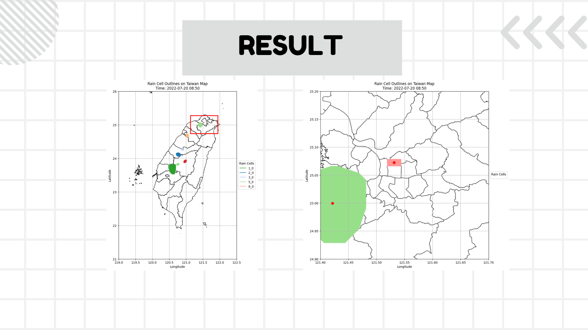
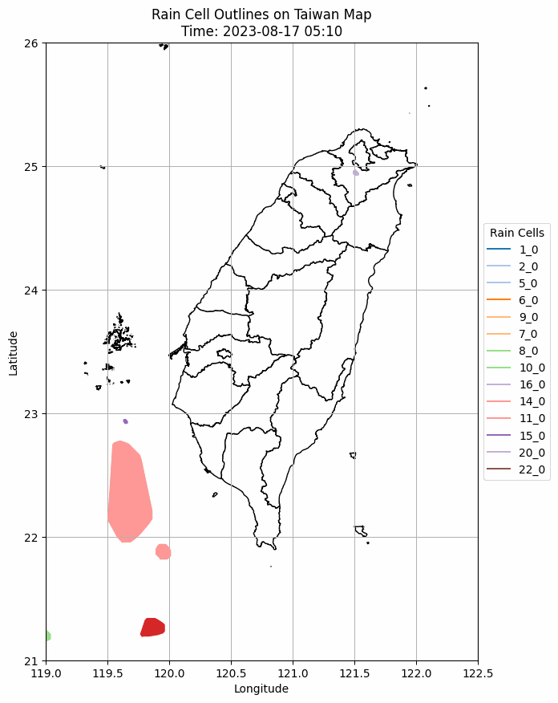
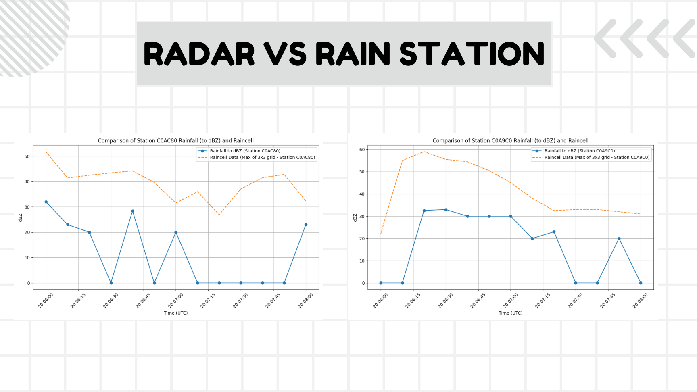
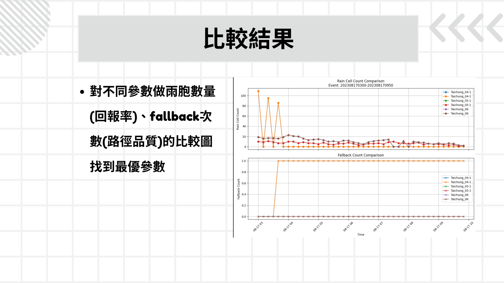
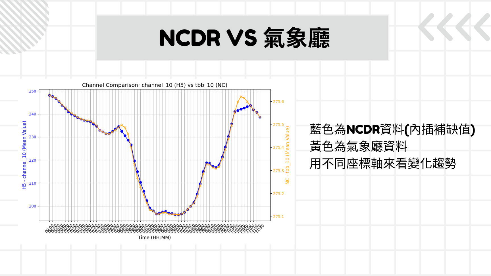

# Taiwan Rain-Cell Tracking and Thunderstorm Analysis

An applied data-science research project that adapts a multi-object cell-tracking workflow to Taiwan radar data and evaluates afternoon-thunderstorm events using radar, rain-gauge, satellite, and event records.

## Research context and credit

This research was conducted in **Professor Li-Pen Wang's (汪立本教授) research group in the Department of Civil Engineering at National Taiwan University**, with guidance from the laboratory's faculty and project team.

The underlying rain-cell tracking system was **not developed from scratch by the author**. It is based on the UK Met Office's MO-cell-tracking codebase. My individual contributions focused on adapting and evaluating that existing system for Taiwan radar data, investigating tracking failures, modifying parts of the workflow, conducting parameter experiments, integrating multiple observational sources, and communicating the research results.

> **Repository status:** This portfolio summary is shared with permission from the NTU research group. The full UK Met Office tracking engine is not redistributed because its upstream licensing remains separate from the laboratory's permission. Raw research datasets are also omitted from this portfolio release.

## Research question

Afternoon thunderstorms in Taiwan are spatially localized, short-lived, and intense. Their short lead times make urban flood response difficult. This project investigates whether radar-derived rain-cell tracks and satellite observations can support earlier and more reliable event characterization.

## What I worked on

- Adapted the cell-tracking workflow to Taiwan-specific grids, UTC+8 timestamps, radar resolution, VIL thresholds, and smoothing parameters.
- Processed HDF5 radar products with Python, NumPy, SciPy, and Matplotlib.
- Identified and tracked rain cells across consecutive radar frames and visualized tracks on Taiwan maps.
- Integrated radar observations, rain-gauge measurements, satellite channels, and event records.
- Diagnosed missing-frame, temporal-alignment, spatial-resolution, and measurement-scale issues.
- Investigated `Zero weight for featId` failures in forward/backward track association.
- Implemented and evaluated a fallback association strategy while comparing track recovery against trajectory-quality risk.
- Tested parameter combinations including VIL thresholds, smoothing width, minimum area, and matching-distance constraints.

## Workflow

1. Collect documented afternoon-thunderstorm events.
2. Load 10-minute radar observations and extract rain-cell features.
3. Project detected cells onto a Taiwan grid and associate features across time.
4. Compare radar-derived signals with nearby rain gauges and satellite channels.
5. Diagnose failed associations and apply a marked fallback strategy only when needed.
6. Compare parameter settings using detected-track counts, fallback frequency, and visual trajectory quality.

## Selected results

The homepage intentionally shows a small set of representative outputs rather than every experiment in the full research presentation.

### Rain-cell detection and mapping

### Track evolution through time

The animation shows exported cell polygons and track continuity across consecutive 10-minute radar frames.

### Radar and rain-gauge validation

The validation work exposed missing rain-gauge observations, temporal offsets, and differences between radar-derived intensity and station measurements. These limitations were treated as analysis findings rather than hidden during preprocessing.

### Parameter and fallback evaluation

### Satellite and observation comparison

The experiments show a recurring trade-off: relaxing association distance can recover more tracks but increases the risk of incorrect matching. A targeted, explicitly labeled fallback method preserves the stricter default matching logic while making exceptional cases measurable during later quality analysis.

## Portfolio code

The [`src`](src/) directory contains cleaned versions of the author's event-screening, visualization, and fallback-summary scripts. They operate on authorized local inputs and exported tracker results without reproducing the upstream Met Office tracking engine.

- [`select_events.py`](src/select_events.py) screens HDF5 radar frames for sustained high-reflectivity events.
- [`visualize_tracks.py`](src/visualize_tracks.py) renders exported GeoJSON tracks and animations.
- [`summarize_fallbacks.py`](src/summarize_fallbacks.py) calculates track and fallback usage statistics.

These files are portfolio refactorings of research scripts, with hard-coded laboratory paths and raw-data copying removed.

## Tools

- Python
- NumPy, Pandas, SciPy
- Matplotlib
- HDF5 / h5py
- GeoJSON and geospatial projection tools
- Linux, Conda, Git

## Research materials

- [Research presentation](docs/Rain_Cell_research_report.pdf)
- [Research poster source](docs/Rain_Cell_research_poster.pptx)

## Reproducibility and data availability

Raw radar, satellite, and rain-gauge datasets are not included in this portfolio release. The included scripts operate on authorized local inputs and exported tracking results. A future update may add a small approved sample or synthetic dataset for reproducible demonstrations.

## Attribution

This project was completed as part of research in Professor Li-Pen Wang's group at the Department of Civil Engineering, National Taiwan University. I am grateful to Professor Wang and the laboratory's project managers and research team for their supervision, domain knowledge, research direction, and collaborative support.

The tracking workflow was adapted from the UK Met Office MO-cell-tracking codebase for research use in Taiwan. This repository does not claim authorship of the original tracking system or sole credit for the broader laboratory research. The individual contributions represented in this portfolio concern Taiwan-specific adaptation, selected code modifications, data integration, failure analysis, fallback evaluation, parameter experiments, visualization, and research communication.

## Author

Cheng-Chi Wu  
MEng in Data Science, UCLA  
B.S. in Civil Engineering, National Taiwan University
